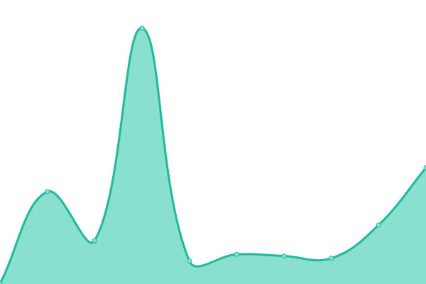
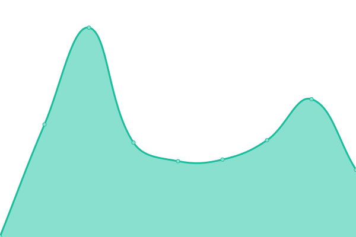

# [📈 Live Status](https://jeffutter.github.io/upptime): <!--live status--> **🟩 All systems operational**

This repository contains the open-source uptime monitor and status page for [Jeffery Utter](https://jeffutter.github.io/upptime), powered by [Upptime](https://github.com/upptime/upptime).

With [Upptime](https://upptime.js.org), you can get your own unlimited and free uptime monitor and status page, powered entirely by a GitHub repository. We use [Issues](https://github.com/jeffutter/upptime/issues) as incident reports, [Actions](https://github.com/jeffutter/upptime/actions) as uptime monitors, and [Pages](https://jeffutter.github.io/upptime) for the status page.

<!--start: status pages-->
<!-- This summary is generated by Upptime (https://github.com/upptime/upptime) -->
<!-- Do not edit this manually, your changes will be overwritten -->

| URL                                     | Status | History                                                                                          | Response Time                                                                     | Uptime                                                                                                                                                                                                                       |
| --------------------------------------- | ------ | ------------------------------------------------------------------------------------------------ | --------------------------------------------------------------------------------- | ---------------------------------------------------------------------------------------------------------------------------------------------------------------------------------------------------------------------------- |
| [Judith Utter](https://judithutter.com) | 🟩 Up  | [judith-utter.yml](https://github.com/jeffutter/upptime/commits/master/history/judith-utter.yml) |  829ms |  |
| [Jeff Utter](https://jeffutter.com/)    | 🟩 Up  | [jeff-utter.yml](https://github.com/jeffutter/upptime/commits/master/history/jeff-utter.yml)     |  334ms   |      |
| POSCG                                   | 🟩 Up  | [poscg.yml](https://github.com/jeffutter/upptime/commits/master/history/poscg.yml)               |  142ms        |                  |

<!--end: status pages-->

[**Visit our status website →**](https://jeffutter.github.io/upptime)

## 📄 License

- Code: [MIT](./LICENSE) © [Jeffery Utter](https://jeffutter.github.io/upptime)
- Data in the `./history` directory: [Open Database License](https://opendatacommons.org/licenses/odbl/1-0/)
